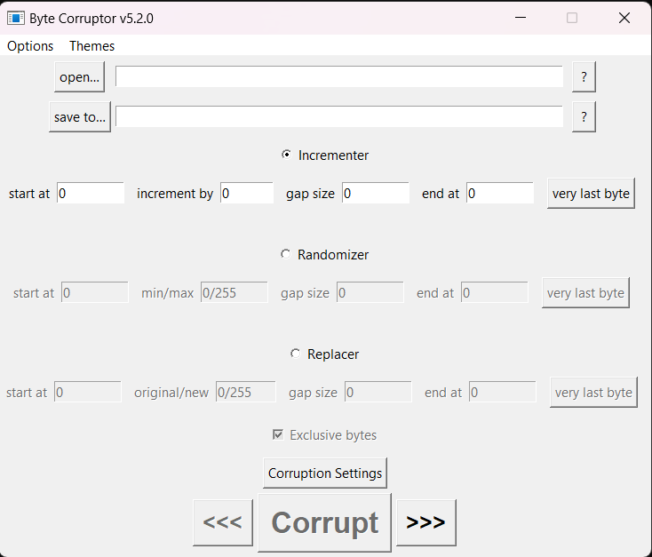

# Byte Corruptor

# Description
This app helps you manipulate the bytes of any file the way you want.

# Features
- Incrementing
- Randomizing
- Replacing
- Swapping
- Copying
- Mixing
---

---
# Usage
1. select a file
2. select where you want to save it
3. pick an algorithm (Incrementer, Randomizer, Replacer, etc..)
4. fill the boxes
5. run it
